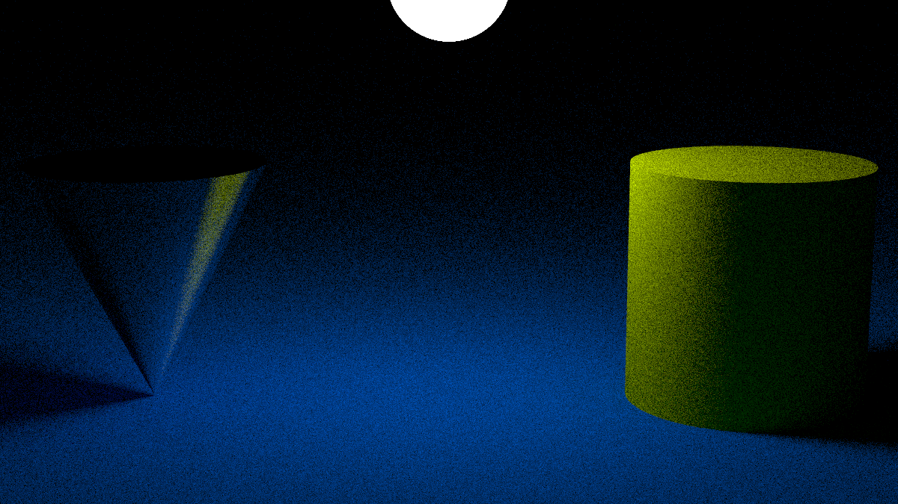

# raytracer

This project is a raytracer written in C++. The goal of this project is to
implement a raytracer that can render scenes with `spheres`, `planes`,
`lights`... The raytracer supports features such as `translation`, `rotation`,
and drop `shadows`. The raytracer outputs the rendered image to a PPM file.

# development

1. Clone the repository.

```sh
git clone git@github.com:Jabolol/raytracer.git .
```

2. Create a build directory.

```sh
mkdir build && cd build
```

3. Build the project.

```sh
cmake .. -GNinja -DBUILD_DOC=OFF -DBUILD_TEST=OFF
```

4. Run the raytracer with a provided scene.

```sh
./raytracer --config ../scenes/cornell.cfg > cornell.ppm
```

# features

## must

> [!TIP]\
> The config file can be found at [`config/must.cfg`](./config/must.cfg)


- [x] sphere
- [x] plane
- [x] translation
- [x] directional light
- [x] ambient light
- [x] flat color
- [x] add primitive to scene
- [x] set up lighting
- [x] set up camera
- [x] output to ppm

## should

> [!TIP]\
> The config file can be found at [`config/should.cfg`](./config/should.cfg)



- [x] cylinder
- [x] cone
- [x] rotation
- [x] drop shadows

## could

> [!TIP]\
> The config file can be found at [`config/could.cfg`](./config/could.cfg)


- [x] multiple directional lights (0.5)
- [x] colored lights (0.5)
- [x] transparency (0.5)
- [x] reflection (1)
- [x] refraction (1)
- [x] texturing from file (1)
- [x] texturing from procedural chessboard (1)
- [x] texturing from procedural perlin noise (1)
- [x] import a scene in a scene (2)
- [x] set up antialiasing through supersampling (0.5)
- [x] space partitioning (2)
- [x] scene preview using a fast renderer (2)

## bonus

> [!TIP]\
> The config file can be found at [`config/bonus.cfg`](./config/bonus.cfg)


- [x] quad box
- [x] motion blur
- [x] depth of field
- [x] quadrilaterals
- [x] constant medium (fog)
- [x] tinted dielectric

## cornell box

> [!TIP]\
> The config file can be found at [`config/cornell.cfg`](./config/cornell.cfg)


