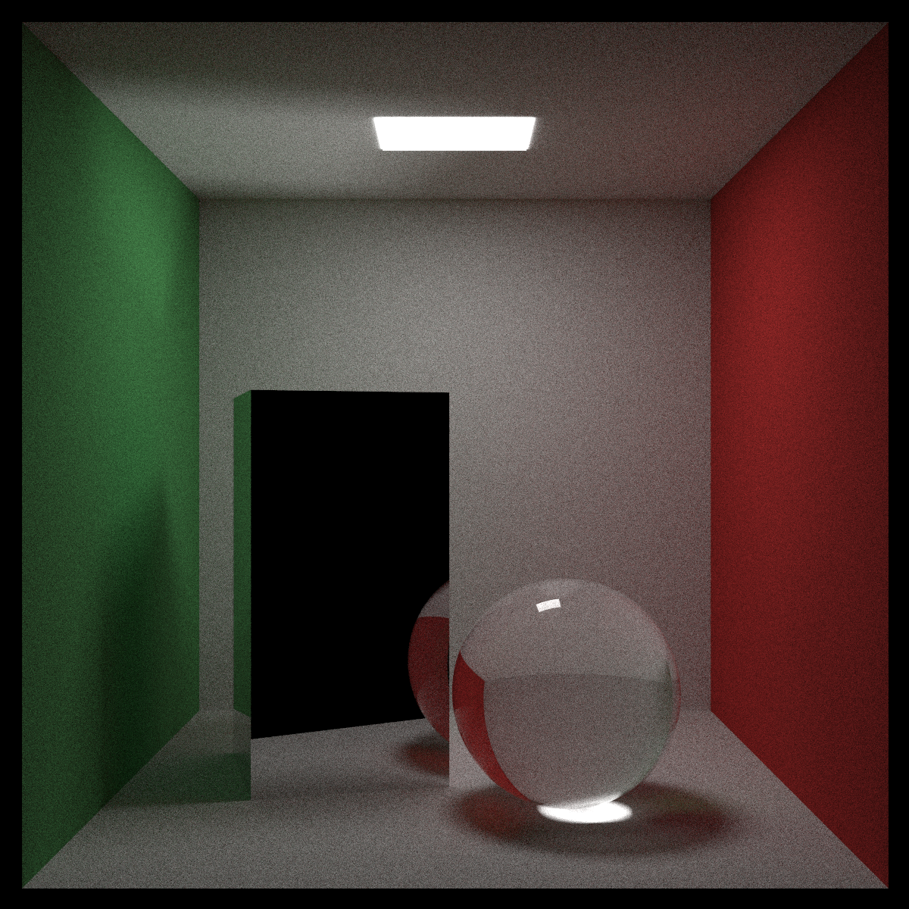

# raytracer

> [!WARNING]\
> This project is a work in progress.

## must

- [x] sphere
- [x] plane
- [x] translation
- [x] directional light
- [x] ambient light
- [x] flat color
- [ ] add primitive to scene
- [ ] set up lighting
- [ ] set up camera
- [x] output to ppm

## should

- [ ] cylinder
- [ ] cone
- [x] rotation
- [x] drop shadows

## could

> [!NOTE]\
> These would give up to `14.5` bonus points.

- [x] multiple directional lights (0.5)
- [x] colored lights (0.5)
- [x] transparency (0.5)
- [x] reflection (1)
- [x] refraction (1)
- [x] texturing from file (1)
- [x] texturing from procedural chessboard (1)
- [x] texturing from procedural perlin noise (1)
- [ ] import a scene in a scene (2)
- [x] set up antialiasing through supersampling (0.5)
- [x] space partitioning (2)
- [ ] display the image during and after rendering (1)
- [ ] exit during or after rendering (0.5)
- [ ] scene preview using a fast renderer (2)
